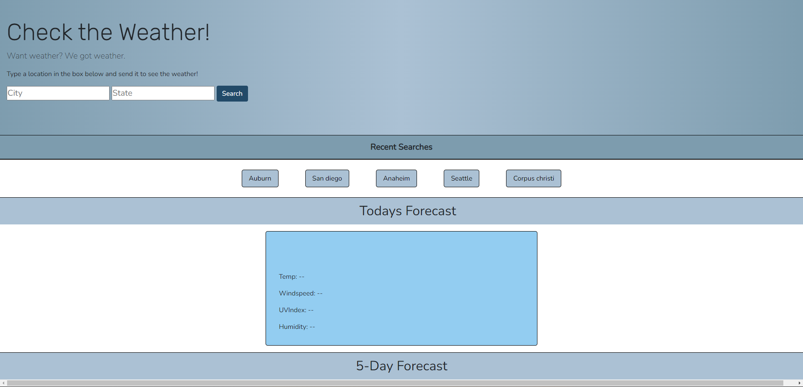
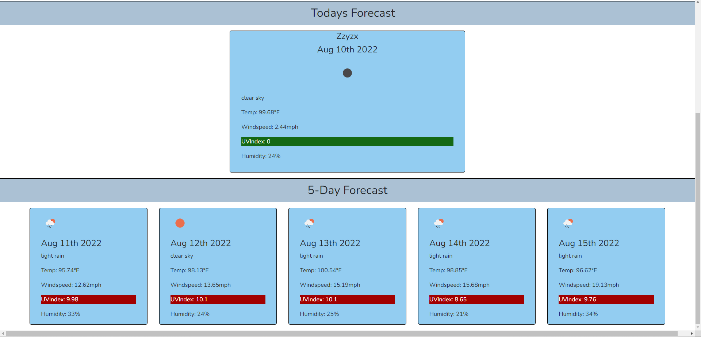
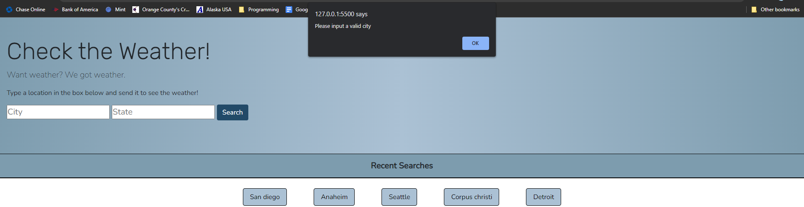

# Challenge 06


## Daily Weather

---

### Contents 

---

1. Objectives
2. About
3. Screenshots
4. Links
5. Assignment details & grading rubric (*ignore me*)

<br>
<br>

### Objectives ###

---

<br>

1. WHEN a city is searched, the user is presented with current and future conditions for that city and that city is added to the search history.
2. WHEN current weather conditions for that city are viewed, the user is presented with the city name, the date, an icon representation of weather conditions, the temperature, the humidity, the wind speed, and the UV index.
3. WHEN the UV index is viewed, the user is presented with a color that indicates whether the conditions are low, moderate, high, very high, or severe.
4. WHEN future weather conditions for that city are viewed, the user is presented with a 5-day forecast that displays the date, an icon representation of weather conditions, the temperature, the wind speed, and the humidity.
5. WHEN a city in the search history is clicked, the user is again presented with current and future conditions for that city.

<br>
<br>

### About ###

---

<br>

1. WHEN a city is searched, the user is presented with current and future conditions for that city and that city is added to the search history.
    > In the header an input field for the city is available, along with an option for the state to help narrow a precise location. Once these fields are input and the search button is clicked, the requested data is returned. First the city and state are geocoded throiugh an inital fetch request and geographical coordinates are extracted and a new request is sent for weather data.

<br>

2. WHEN current weather conditions for that city are viewed, the user is presented with the city name, the date, an icon representation of weather conditions, the temperature, the humidity, the wind speed, and the UV index.
    > Once the weather data request is returned the current weather condition data is extracted from the data packet and displayed on screen for the user to see. This includes the city name, the provided icon, current tempurature, humidity, windspeed, and UV index.

<br>

3. WHEN the UV index is viewed, the user is presented with a color that indicates whether the conditions are low, moderate, high, very high, or severe.
    > A switch statement is used int he setUVColors() function to compare the UV index values and change the css to provide a colored background to indicate the severity of the UV index. Green is coded for the lowest, and purple the highest.
<br>

4. WHEN future weather conditions for that city are viewed, the user is presented with a 5-day forecast that displays the date, an icon representation of weather conditions, the temperature, the wind speed, and the humidity.
    > Once a city is searched a five day forecast with dates is populated with the same data as the current weather. This is completed by the buildResults() function iterating through the provided data and adding DOM elements for each iteration.

<br>

5. WHEN a city in the search history is clicked, the user is again presented with current and future conditions for that city.
    > The five most recently searched cities are stored to local storage in a simple array. Each time a search is completed the buildRecents() function is called which clears the HTML of the parent element and creates a button for each element of the array. A while loop is used to ensure that the array is never larger than 5 elements. If the array has any further elements added the shift() method is called to remove the oldest elements out in favor of newly pushed elements. A data value is assigned to each button, an event listener for the button is built that calls the buildGeoRequest() function, which starts the entire process of data requests over.


<br>
<br>

### Screenshots ###

---

<br>



<br>

Initial state.

<br>

  ---

<br>



<br>

Showing search results.

<br>

  ---

<br>



<br>

Alert if search box is left empty.

<br>


### Links ###

---

<br>


Link to Github repo: https://github.com/JDReeves86/06ChallengeTurnIn


Link to live page: https://jdreeves86.github.io/06ChallengeTurnIn/

<br>
<br>
<br>
<br>
<br>
<br>
<br>
<br>
<br>

---

---

## Assignment Details & Grading Rubric ##

---

---

<br>
<br>


# 06 Server-Side APIs: Weather Dashboard

## Your Task

Third-party APIs allow developers to access their data and functionality by making requests with specific parameters to a URL. Developers are often tasked with retrieving data from another application's API and using it in the context of their own. Your challenge is to build a weather dashboard that will run in the browser and feature dynamically updated HTML and CSS.

Use the [OpenWeather One Call API](https://openweathermap.org/api/one-call-api) to retrieve weather data for cities. Read through the documentation for setup and usage instructions. You will use `localStorage` to store any persistent data. For more information on how to work with the OpenWeather API, refer to the [Full-Stack Blog on how to use API keys](https://coding-boot-camp.github.io/full-stack/apis/how-to-use-api-keys).

## User Story

```
AS A traveler
I WANT to see the weather outlook for multiple cities
SO THAT I can plan a trip accordingly
```

## Acceptance Criteria

```
GIVEN a weather dashboard with form inputs
WHEN I search for a city
THEN I am presented with current and future conditions for that city and that city is added to the search history
WHEN I view current weather conditions for that city
THEN I am presented with the city name, the date, an icon representation of weather conditions, the temperature, the humidity, the wind speed, and the UV index
WHEN I view the UV index
THEN I am presented with a color that indicates whether the conditions are favorable, moderate, or severe
WHEN I view future weather conditions for that city
THEN I am presented with a 5-day forecast that displays the date, an icon representation of weather conditions, the temperature, the wind speed, and the humidity
WHEN I click on a city in the search history
THEN I am again presented with current and future conditions for that city
```

## Mock-Up

The following image shows the web application's appearance and functionality:


## Grading Requirements

> **Note**: If a Challenge assignment submission is marked as “0”, it is considered incomplete and will not count towards your graduation requirements. Examples of incomplete submissions include the following:
>
> * A repository that has no code
>
> * A repository that includes a unique name but nothing else
>
> * A repository that includes only a README file but nothing else
>
> * A repository that only includes starter code

This Challenge is graded based on the following criteria: 

### Technical Acceptance Criteria: 40%

* Satisfies all of the above acceptance criteria plus the following:

    * Uses the OpenWeather API to retrieve weather data.

    * Uses `localStorage` to store persistent data.

### Deployment: 32%

* Application deployed at live URL.

* Application loads with no errors.

* Application GitHub URL submitted.

* GitHub repository that contains application code.

### Application Quality: 15%

* Application user experience is intuitive and easy to navigate.

* Application user interface style is clean and polished.

* Application resembles the mock-up functionality provided in the Challenge instructions.

### Repository Quality: 13%

* Repository has a unique name.

* Repository follows best practices for file structure and naming conventions.

* Repository follows best practices for class/id naming conventions, indentation, quality comments, etc.

* Repository contains multiple descriptive commit messages.

* Repository contains quality readme file with description, screenshot, and link to deployed application.

## Review

You are required to submit BOTH of the following for review:

* The URL of the functional, deployed application.

* The URL of the GitHub repository. Give the repository a unique name and include a readme describing the project.

- - -
© 2022 Trilogy Education Services, LLC, a 2U, Inc. brand. Confidential and Proprietary. All Rights Reserved.
